# FlowGraph Builder – Full Mermaid Diagrams Document

Copy-paste this entire document into any Markdown/Mermaid renderer (Obsidian, Notion, GitHub, VS Code + Mermaid plugin, mermaid.live) to see **14 interactive, production-grade diagrams**.

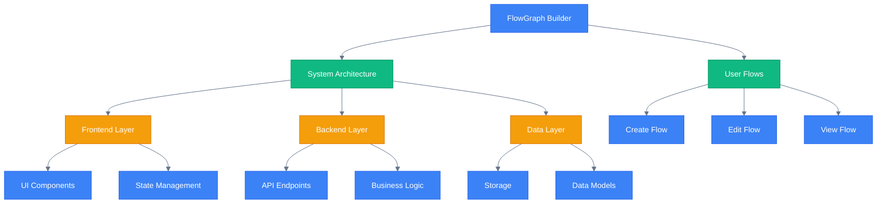

## 1. High-Level Product User Journey (Sequence Diagram)

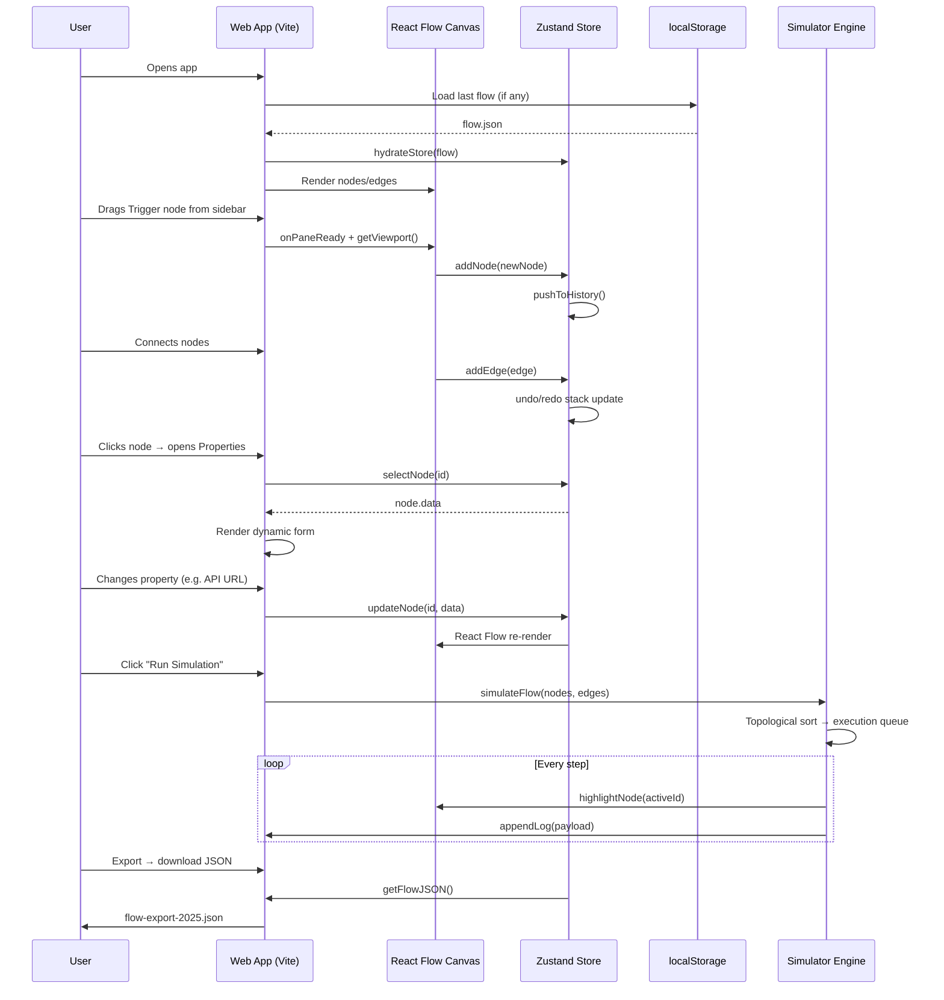

---

## 2. System Architecture (Component Diagram)

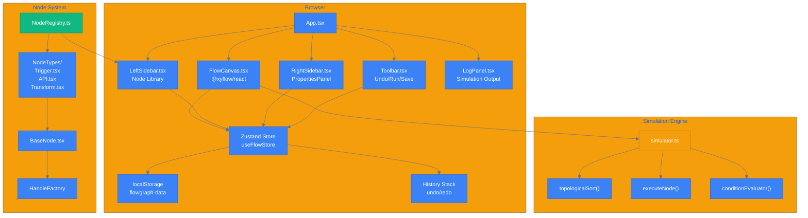

---

## 3. Node Type Class Diagram (UML)

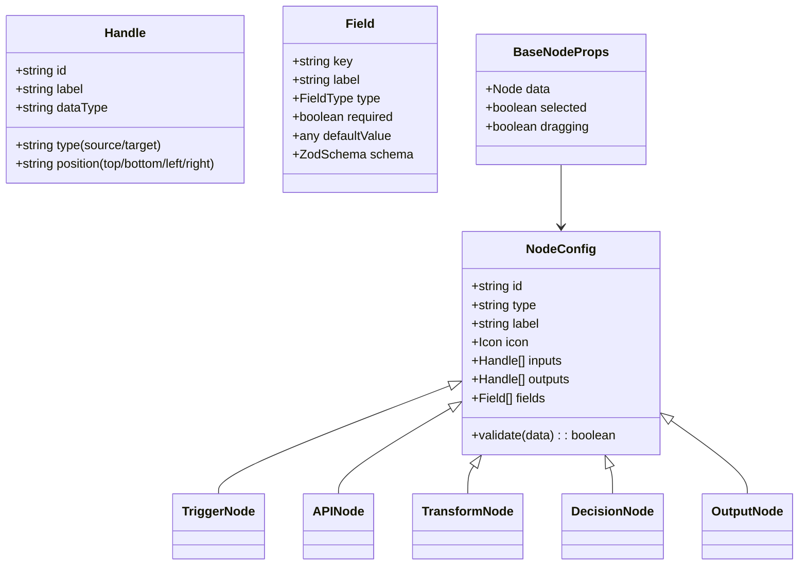

---

## 4. State Management Flow (Zustand Store)

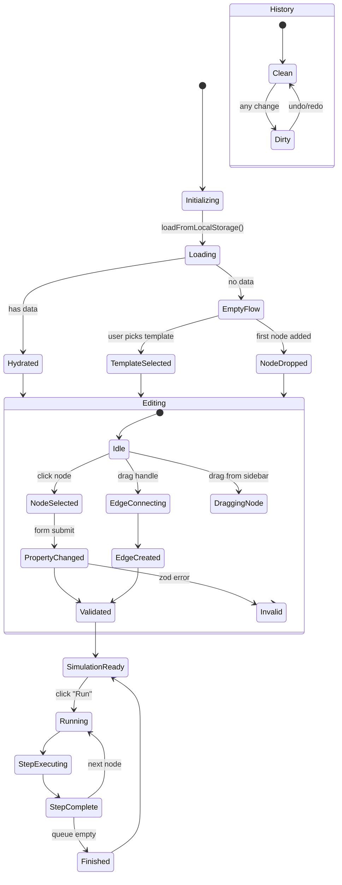

---

## 5. Drag & Drop User Flow (Flowchart)

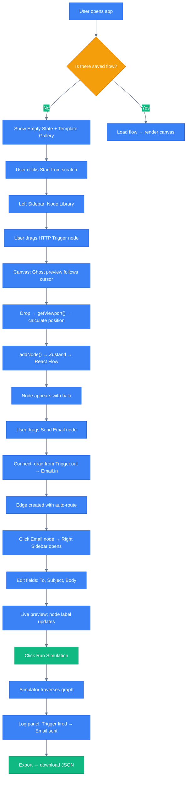

---

## 6. Simulation Execution Engine (Detailed Flowchart)

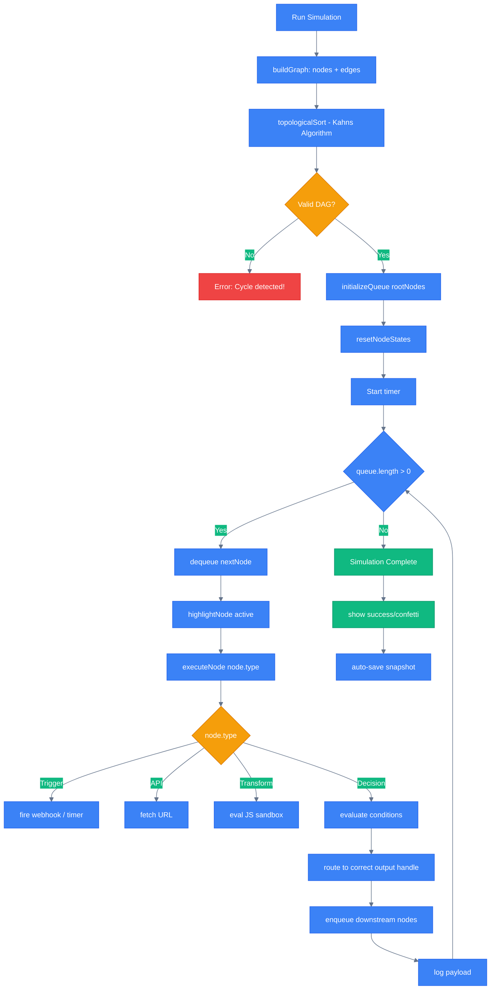

---

## 7. File Structure (Tree Diagram)

```bash
    src/
    ├── App.tsx
    ├── main.tsx
    ├── components/
    │   ├── canvas/
    │   │   ├── FlowCanvas.tsx
    │   │   └── MiniMapCustom.tsx
    │   ├── sidebar/
    │   │   ├── LeftSidebar.tsx
    │   │   ├── RightSidebar.tsx
    │   │   └── PropertiesPanel.tsx
    │   ├── nodes/
    │   │   ├── BaseNode.tsx
    │   │   ├── custom/
    │   │   │   ├── TriggerNode.tsx
    │   │   │   ├── APINode.tsx
    │   │   │   └── TransformNode.tsx
    │   │   └── NodeIcon.tsx
    │   ├── ui/
    │   │   ├── Toolbar.tsx
    │   │   ├── LogPanel.tsx
    │   │   └── TourOverlay.tsx
    ├── store/
    │   ├── useFlowStore.ts
    │   └── historyMiddleware.ts
    ├── lib/
    │   ├── nodeRegistry.ts
    │   ├── edgeRegistry.ts
    │   ├── simulator.ts
    │   └── validators.ts
    ├── types/
    │   ├── flow.types.ts
    │   └── node.types.ts
    ├── templates/
    │   ├── api-to-slack.json
    │   └── cron-email.json
    ├── assets/
    │   └── icons/
    └── utils/
        ├── topologicalSort.ts
        └── safeEval.ts
```
```mermaid
%%{init: {'theme':'base', 'themeVariables': {'fontSize':'13px','primaryColor':'#3b82f6','primaryTextColor':'#fff','primaryBorderColor':'#2563eb','lineColor':'#64748b','secondaryColor':'#10b981','tertiaryColor':'#f59e0b'}}}%%
graph TD
    Root["src/"] --> App["App.tsx"]
    Root --> Main["main.tsx"]
    Root --> Components["components/"]
    Root --> Store["store/"]
    Root --> Lib["lib/"]
    Root --> Types["types/"]
    Root --> Templates["templates/"]
    Root --> Assets["assets/"]
    Root --> Utils["utils/"]

    Components --> Canvas["canvas/"]
    Components --> Sidebar["sidebar/"]
    Components --> Nodes["nodes/"]
    Components --> UI["ui/"]

    Canvas --> FlowCanvas["FlowCanvas.tsx"]
    Canvas --> MiniMap["MiniMapCustom.tsx"]

    Sidebar --> LeftSidebar["LeftSidebar.tsx"]
    Sidebar --> RightSidebar["RightSidebar.tsx"]
    Sidebar --> PropertiesPanel["PropertiesPanel.tsx"]

    Nodes --> BaseNode["BaseNode.tsx"]
    Nodes --> Custom["custom/"]
    Nodes --> NodeIcon["NodeIcon.tsx"]

    Custom --> TriggerNode["TriggerNode.tsx"]
    Custom --> APINode["APINode.tsx"]
    Custom --> TransformNode["TransformNode.tsx"]

    UI --> Toolbar["Toolbar.tsx"]
    UI --> LogPanel["LogPanel.tsx"]
    UI --> TourOverlay["TourOverlay.tsx"]

    Store --> FlowStore["useFlowStore.ts"]
    Store --> History["historyMiddleware.ts"]

    Lib --> NodeRegistry["nodeRegistry.ts"]
    Lib --> EdgeRegistry["edgeRegistry.ts"]
    Lib --> Simulator["simulator.ts"]
    Lib --> Validators["validators.ts"]

    Types --> FlowTypes["flow.types.ts"]
    Types --> NodeTypes["node.types.ts"]

    Templates --> ApiSlack["api-to-slack.json"]
    Templates --> CronEmail["cron-email.json"]

    Assets --> Icons["icons/"]

    Utils --> TopoSort["topologicalSort.ts"]
    Utils --> SafeEval["safeEval.ts"]

    style Root fill:#3b82f6,stroke:#2563eb,color:#fff
    style Components fill:#10b981,stroke:#059669,color:#fff
    style Store fill:#10b981,stroke:#059669,color:#fff
    style Lib fill:#10b981,stroke:#059669,color:#fff
    style Types fill:#10b981,stroke:#059669,color:#fff
    style Canvas fill:#f59e0b,stroke:#d97706,color:#fff
    style Sidebar fill:#f59e0b,stroke:#d97706,color:#fff
    style Nodes fill:#f59e0b,stroke:#d97706,color:#fff
    style UI fill:#f59e0b,stroke:#d97706,color:#fff
```

---

## 8. Data Flow (C4 Context → Container → Component)

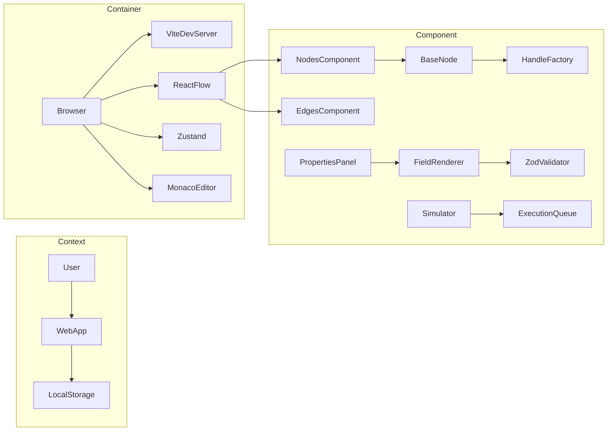

---

## 9. Onboarding Tour Steps (Sequence)

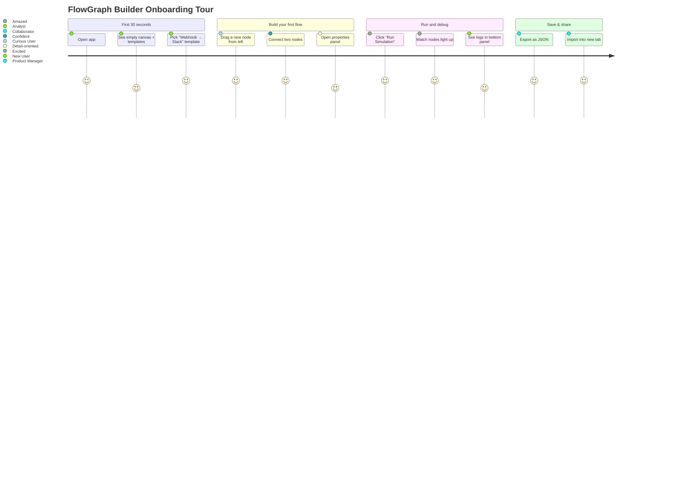

---

## 10. MVP vs Post-MVP Roadmap (Gantt)

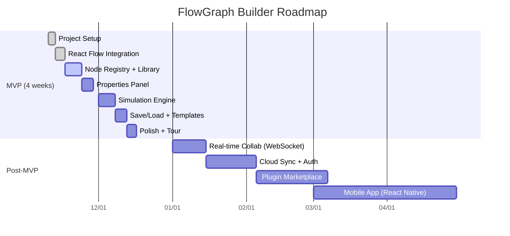

---
